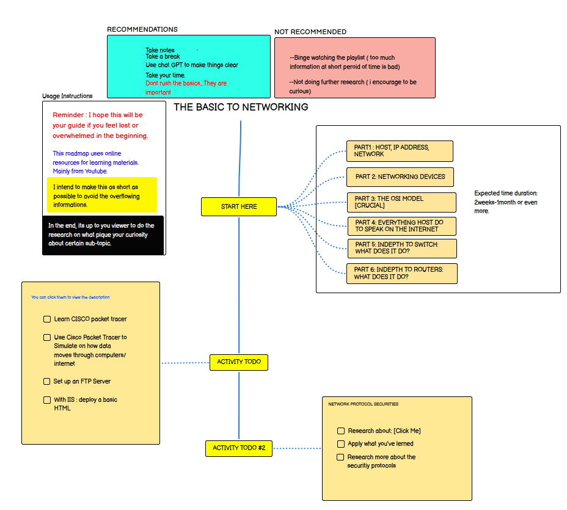

# Ultimate Basic Computer Networking Path

Status: 🟡 In Progress

Welcome to my first repository! This will be a beginner-friendly guide to essential computer networking concepts. 

Aim:
To introduce some basic, necessary concepts and help viewers expand their own understanding without overwhelming them with intermediate topics.

Goals:
Introduce fundamental networking concepts in a simple, digestible way.
Encourage self-learning by providing clear starting points and resources.

You can directly acces the roadmap here : https://roadmap.sh/r/my-personal-basic-networking-roadmap

